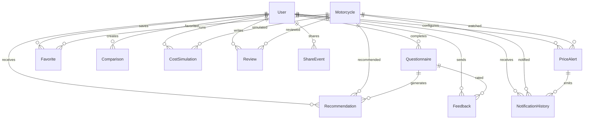

# Base de datos

[Volver al indice](../README.md)

## Resumen

MotorMatch usa Prisma con datasource PostgreSQL:

- Schema: `backend/prisma/schema.prisma`
- Runtime: `DATABASE_URL`
- Migraciones/conexion directa: `DIRECT_URL`
- Proveedor esperado: PostgreSQL/Supabase

El schema actual define usuarios, motos, favoritos, cuestionarios, recomendaciones, comparaciones, simulaciones de costo, eventos de compartir, feedback, resenas, alertas de precio e historial de notificaciones.

## Entidades principales

### `User`

Tabla: `users`

Representa a la persona registrada.

Campos clave:

- `id`: PK autoincremental.
- `email`: unico.
- `passwordHash`: hash bcrypt.
- `fullName`, `phone`, `birthDate`, `city`.
- `heightCm`, `weightKg`, `ridingExperience`, `monthlyMileage`.
- `preferredBrands`: arreglo de marcas.
- `budgetRange`: JSON con presupuesto.
- `emailVerified`, `verificationToken`, `verificationExpiresAt`.
- `resetPasswordToken`, `resetPasswordExpiresAt`.
- `isActive`, `lastLogin`, `createdAt`, `updatedAt`.

Relaciones:

- Muchos cuestionarios, recomendaciones, favoritos, comparaciones, simulaciones, resenas, eventos, feedback, alertas y notificaciones.

### `Motorcycle`

Tabla: `motorcycles`

Catalogo de motos.

Campos clave:

- `brand`, `model`, `year`.
- `engineCc`, `engineType`, `powerHp`, `torqueNm`.
- `weightKg`, `seatHeightCm`.
- `fuelType`, `fuelTankLiters`, `consumptionKmpl`.
- `transmission`, `brakeSystem`.
- `price`, `currency`.
- `soatEstimated`, `registrationEstimated`.
- `imageUrl`, `galleryImages`, `description`.
- `advantages`, `disadvantages`.
- `colors`, `countryOrigin`, `warranty`.
- `isActive`, timestamps.

Relaciones:

- Recomendaciones, favoritos, simulaciones, resenas, alertas y notificaciones.

### `Favorite`

Tabla: `favorites`

Relacion usuario-moto.

Restricciones:

- Unico por `userId + motorcycleId`.
- Cascade delete al eliminar usuario o moto.

Uso:

- Marcar motos favoritas.
- Alimentar analitica de mercado.

### `Comparison`

Tabla: `comparisons`

Guarda historial de comparaciones de 2 o 3 motos.

Campos:

- `userId`.
- `bikeId1`, `bikeId2`, `bikeId3`.
- `comparisonDate`.

Nota real: el modelo no tiene relacion Prisma directa con `Motorcycle`; el servicio consulta por SQL joins.

### `Questionnaire`

Tabla: `questionnaires`

Perfil de recomendacion del usuario.

Campos:

- `budget`.
- `includesSoat`, `includesRegistration`.
- `usageType`, `frequency`.
- `hasPassenger`, `passengerFrequency`.
- `heightCm`, `weightKg`, `comfortWithHeavy`.
- `recommendationIds`: IDs generados.
- `completedAt`, `createdAt`.

Relaciones:

- Pertenece opcionalmente a `User`.
- Tiene recomendaciones y feedback.

### `Recommendation`

Tabla: `recommendations`

Resultado persistido del motor de scoring.

Campos:

- `userId`, `motorcycleId`, `questionnaireId`.
- `compatibilityScore`.
- `reasons`: JSON.
- `warnings`: arreglo.
- `isSaved`, `viewedAt`, `savedAt`.
- `createdAt`.

Restriccion:

- Unica por `userId + motorcycleId + questionnaireId`.

### `PriceAlert`

Tabla: `price_alerts`

Alerta de precio por usuario y moto.

Campos:

- `userId`, `motorcycleId`.
- `targetPrice`.
- `notificationType`: enum.
- `status`: enum.
- `lastNotifiedAt`.
- timestamps.

Reglas implementadas:

- Maximo 10 alertas activas por usuario.
- No duplicar alerta activa o pausada para la misma moto.
- Soft delete mediante estado `DELETED`.

### `NotificationHistory`

Tabla: `notification_history`

Historial de disparos de alerta.

Campos:

- `userId`, `alertId`, `motorcycleId`.
- `previousPrice`, `newPrice`.
- `type`.
- `isRead`.
- `sentAt`.

Uso:

- Historial in-app.
- Auditoria del worker.
- Base para cooldown anti-spam.

## Entidades complementarias

### `CostSimulation`

Tabla: `cost_simulations`

Historial de simulaciones de costos.

Campos:

- `motorcycleId`, `userId`.
- `motorPrice`, `soatCost`, `registrationCost`, `vehicleTaxCost`, `managementCost`.
- `totalCost`, `budgetExceeded`, `budgetExceededPercent`.
- `userEditedValues`.
- `savedAt`.

### `ShareEvent`

Tabla: `share_events`

Evento de compartir por WhatsApp.

Campos:

- `userId`, `channel`, `source`, `itemCount`, `messageLength`, `createdAt`.

### `Feedback`

Tabla: `feedback`

Feedback sobre recomendaciones.

Campos:

- `userId`, `questionnaireId`.
- `recommendationSignature`: firma derivada de IDs recomendados.
- `isUseful`.
- `improvement`.
- `createdAt`.

Restriccion:

- Unico por `userId + questionnaireId + recommendationSignature`.

### `Review`

Tabla: `reviews`

Resena de usuario sobre moto.

Campos:

- `userId`, `motorcycleId`, `rating`, `comment`.
- timestamps.

Restriccion:

- Una resena por usuario y moto.

## Enums

### `NotificationType`

```text
EMAIL
IN_APP
BOTH
```

### `AlertStatus`

```text
ACTIVE
PAUSED
DELETED
```

## Relaciones Prisma



## Diagrama textual

```text
User
|-- Questionnaire
|   |-- Recommendation
|   `-- Feedback
|-- Favorite -- Motorcycle
|-- Comparison (bikeId1, bikeId2, bikeId3 -> motorcycles por SQL)
|-- CostSimulation -- Motorcycle
|-- Review -- Motorcycle
|-- ShareEvent
|-- PriceAlert -- Motorcycle
|   `-- NotificationHistory -- Motorcycle
`-- NotificationHistory
```

## Indices importantes

| Modelo | Indice/constraint | Proposito |
| --- | --- | --- |
| `User` | `email @unique` | login y unicidad de cuenta |
| `User` | `verificationToken @unique` | verificacion email |
| `User` | `resetPasswordToken @unique` | recuperacion de contrasena |
| `Motorcycle` | `idx_motorcycles_brand_model` | busqueda por marca/modelo |
| `Favorite` | `unique_user_motorcycle_favorite` | evita favoritos duplicados |
| `Favorite` | `idx_favorites_user_id` | listar favoritos del usuario |
| `Recommendation` | `unique_recommendation` | evita duplicar recomendacion en una generacion |
| `Comparison` | `idx_comparisons_user_id` | historial por usuario |
| `CostSimulation` | `idx_cost_simulations_user_id` | historial de simulaciones |
| `CostSimulation` | `idx_cost_simulations_motorcycle_id` | consultas por moto |
| `ShareEvent` | `idx_share_events_user_id` | analitica por usuario |
| `ShareEvent` | `idx_share_events_source` | analitica por fuente |
| `Feedback` | `unique_feedback_per_generation` | un feedback por generacion |
| `Review` | `unique_user_motorcycle_review` | una resena por usuario/moto |
| `Review` | `idx_reviews_motorcycle_id` | resenas por moto |
| `PriceAlert` | `unique_alert_per_user_moto` | evita duplicados por usuario/moto/precio/estado |
| `PriceAlert` | `idx_pricealerts_status_notified` | worker de cron y cooldown |
| `PriceAlert` | `idx_pricealerts_user_status` | panel de alertas |
| `PriceAlert` | `idx_pricealerts_motorcycle_status` | analitica de demanda |
| `NotificationHistory` | `idx_notifications_alert_sentat` | cooldown anti-spam |
| `NotificationHistory` | `idx_notifications_user_read` | notificaciones in-app no leidas |

## Estrategia anti-spam

La estrategia real esta en `backend/src/workers/priceAlerts.worker.js`:

- Solo procesa alertas `ACTIVE`.
- Envia si `motorcycle.price <= alert.targetPrice`.
- No renotifica antes de 48 horas si `lastNotifiedAt` existe.
- Registra `NotificationHistory`.
- Actualiza `lastNotifiedAt` en la misma transaccion.

## Batching del worker

El worker procesa motos con alertas activas en lotes de 500:

```text
offset = 0
BATCH_SIZE = 500
mientras existan motos con alertas activas:
  consultar motos con price != null y alertas ACTIVE
  procesar alertas de cada moto
  si el lote trajo menos de 500, terminar
  si no, offset += 500
```

Esto evita cargar todo el universo de alertas en memoria. Para grandes volumenes, se recomienda migrar a cursor pagination o jobs por cola.

## Escalabilidad futura

- Separar `PriceAlertsWorker` del proceso web para evitar multiples cron corriendo con replicas.
- Usar BullMQ/Redis o una cola administrada.
- Reemplazar `skip/offset` por cursor basado en `id`.
- Agregar indice compuesto para filtros frecuentes del catalogo: `price`, `engineCc`, `isActive`.
- Evaluar full-text search para `brand`, `model`, `description`.
- Versionar migraciones Prisma y ejecutar `prisma migrate deploy` en CI/CD.
- Crear particionamiento o archivado para `notification_history` si crece demasiado.

## TODO manual

- Crear y commitear migraciones en `backend/prisma/migrations`.
- Validar si `Comparison.bikeId*` debe modelarse con relaciones Prisma explicitas.
- Agregar indice para `Motorcycle.isActive + price + engineCc` si el catalogo crece.
- Definir politica de retencion de `NotificationHistory` y `ShareEvent`.
