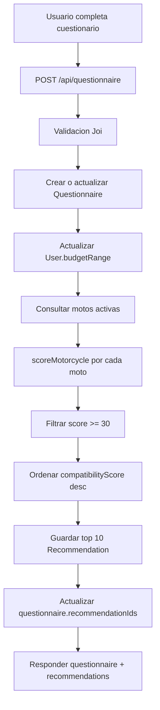

# Sistema de recomendaciones

[Volver al indice](../README.md)

## Archivos reales

- Algoritmo: `backend/src/modules/recommendations/recommendation.algorithm.js`
- Persistencia: `backend/src/modules/recommendations/recommendation.service.js`
- Orquestacion desde cuestionario: `backend/src/modules/questionnaire/questionnaire.service.js`
- Endpoint real de generacion: `POST /api/questionnaire`
- Endpoint real de consulta: `GET /api/questionnaire/my/recommendations`

No existe una ruta dedicada `/api/recommendations`.

## Flujo completo



## Entradas del cuestionario

Campos usados por el algoritmo:

| Campo | Uso |
| --- | --- |
| `budget` | calcula ajuste de presupuesto |
| `includesSoat` | resta SOAT estimado al presupuesto efectivo |
| `includesRegistration` | resta matricula estimada al presupuesto efectivo |
| `usageType` | ajusta cilindraje recomendado |
| `heightCm` | compara altura del usuario con altura del asiento |
| `weightKg` | se guarda, pero el algoritmo actual no lo usa directamente |
| `comfortWithHeavy` | define tolerancia a motos pesadas |
| `preferredBrands` | viene del perfil del usuario y puede sumar puntos |

## Ponderaciones reales

El comentario del archivo indica maximo 100 puntos:

| Categoria | Maximo |
| --- | ---: |
| Presupuesto | 40 |
| Estatura | 20 |
| Peso / comodidad | 15 |
| Uso | 25 |

Adicionalmente el codigo suma hasta 10 puntos por marca preferida, pero el resultado final se recorta con `Math.min(score, 100)`. Por eso el maximo efectivo sigue siendo 100.

## Formula general

```text
score_total = min(
  score_presupuesto
  + score_estatura
  + score_peso
  + score_uso
  + score_marca_preferida,
  100
)
```

Se guardan:

- `compatibilityScore`: entero final.
- `reasons`: razones positivas.
- `warnings`: advertencias.

## Presupuesto

Presupuesto efectivo:

```text
effectiveBudget = budget
if includesSoat:
  effectiveBudget -= motorcycle.soatEstimated
if includesRegistration:
  effectiveBudget -= motorcycle.registrationEstimated
```

Relacion:

```text
ratio = motorcycle.price / effectiveBudget
```

Reglas:

| Condicion | Puntos | Resultado |
| --- | ---: | --- |
| `budget <= 0` | 20 | razon: sin restriccion |
| `ratio > 1.08` | 0 | warning: supera presupuesto |
| `1 < ratio <= 1.08` | 8 | warning: ligeramente sobre presupuesto |
| `0.75 <= ratio <= 1` | 40 | razon: dentro del presupuesto |
| `0.45 <= ratio < 0.75` | 28 | razon: precio razonable |
| `ratio < 0.45` | 15 | razon: muy por debajo del presupuesto |

## Estatura

El algoritmo estima la entrepierna como:

```text
inseam = userHeightCm * 0.47
diff = motorcycle.seatHeightCm - inseam
```

Reglas:

| Condicion | Puntos | Resultado |
| --- | ---: | --- |
| `diff < 5` | 20 | puede apoyar ambos pies |
| `5 <= diff < 10` | 12 | puede apoyar puntas |
| `diff >= 10` | 0 | warning: moto muy alta |

## Peso / comodidad

Reglas:

| Condicion | Puntos | Resultado |
| --- | ---: | --- |
| `comfortWithHeavy === true` | 15 | comodo con cualquier peso |
| `motorcycle.weightKg <= 130` | 15 | moto ligera |
| `<= 175` | 10 | peso intermedio |
| `<= 220` | 5 | sin razon explicita |
| `> 220` | 0 | warning: alto peso |

## Uso

### Ciudad o trabajo

| Cilindraje | Puntos |
| --- | ---: |
| `cc <= 150` | 25 |
| `151 <= cc <= 250` | 15 |
| `cc > 250` | 5 + warning |

### Carretera o deporte

| Cilindraje | Puntos |
| --- | ---: |
| `cc >= 250` | 25 |
| `150 <= cc < 250` | 15 |
| `cc < 150` | 5 + warning |

### Mixto

| Cilindraje | Puntos |
| --- | ---: |
| `150 <= cc <= 300` | 25 |
| otro | 12 |

### Offroad

| Cilindraje | Puntos |
| --- | ---: |
| `150 <= cc <= 300` | 22 |
| otro | 10 |

### Uso indefinido

Suma 12 puntos neutros.

## Marca preferida

Si `User.preferredBrands` contiene la marca de la moto, suma 10 puntos.

```text
if uppercase(motorcycle.brand) in uppercase(preferredBrands):
  score += 10
```

## Matching de motos

El servicio consulta motos activas:

```js
where: { isActive: true }
```

Campos usados:

- `id`
- `brand`
- `model`
- `year`
- `engineCc`
- `price`
- `imageUrl`
- `seatHeightCm`
- `weightKg`
- `consumptionKmpl`
- `soatEstimated`
- `registrationEstimated`

Luego:

```text
ranked = motorcycles
  .map(scoreMotorcycle)
  .filter(compatibilityScore >= 30)
  .sort(desc compatibilityScore)
top10 = ranked.slice(0, 10)
```

## Manejo de empates

El codigo actual ordena solo por `compatibilityScore desc`. Si dos motos tienen el mismo puntaje, JavaScript conserva el orden relativo del arreglo de entrada en motores modernos, pero no hay desempate de negocio explicito.

TODO recomendado:

```text
ordenar por:
  1. compatibilityScore desc
  2. menor diferencia entre price y effectiveBudget
  3. marca preferida
  4. menor consumo o menor peso, segun usageType
```

## Pseudocodigo

```text
function generateRecommendations(userId, questionnaireId, profile):
  motorcycles = findMany Motorcycle where isActive = true
  ranked = []

  for moto in motorcycles:
    score = 0
    reasons = []
    warnings = []

    score += scoreBudget(moto, profile, reasons, warnings)
    score += scoreHeight(moto, profile, reasons, warnings)
    score += scoreWeight(moto, profile, reasons, warnings)
    score += scoreUsage(moto, profile, reasons, warnings)
    score += scorePreferredBrand(moto, profile, reasons)

    score = min(score, 100)

    if score >= 30:
      ranked.push({ moto, score, reasons, warnings })

  ranked.sort(score desc)
  top10 = ranked[0..9]
  save top10 as Recommendation
  return saved recommendations
```

## Ejemplo practico

Perfil:

```json
{
  "budget": 12000000,
  "includesSoat": true,
  "includesRegistration": false,
  "usageType": "ciudad",
  "heightCm": 170,
  "comfortWithHeavy": false,
  "preferredBrands": ["YAMAHA"]
}
```

Moto:

```json
{
  "brand": "YAMAHA",
  "price": 9800000,
  "soatEstimated": 900000,
  "seatHeightCm": 79,
  "weightKg": 135,
  "engineCc": 150
}
```

Calculo:

```text
effectiveBudget = 12000000 - 900000 = 11100000
ratio = 9800000 / 11100000 = 0.88
presupuesto = 40

inseam = 170 * 0.47 = 79.9
diff = 79 - 79.9 = -0.9
estatura = 20

peso 135kg = 10
uso ciudad con 150cc = 25
marca preferida = 10

score_total = min(40 + 20 + 10 + 25 + 10, 100) = 100
```

## Persistencia

Cada recomendacion guardada contiene:

```json
{
  "userId": 1,
  "questionnaireId": 3,
  "motorcycleId": 10,
  "compatibilityScore": 100,
  "reasons": ["Precio dentro de tu presupuesto"],
  "warnings": []
}
```

El cuestionario guarda `recommendationIds` para construir la firma de feedback.

## Posibles mejoras futuras

- Separar el maximo formal de categorias y decidir si marca preferida debe reemplazar parte del puntaje o funcionar como bonus.
- Incorporar `weightKg` del usuario en ergonomia.
- Usar `frequency`, `hasPassenger` y `passengerFrequency`, actualmente guardados pero no usados en el scoring.
- Incluir consumo (`consumptionKmpl`) para usuarios de trabajo o alto kilometraje.
- Agregar desempates deterministas.
- Registrar version del algoritmo en `Recommendation`.
- Usar feedback (`isUseful`) para calibrar pesos.
- Agregar explicabilidad por categoria en vez de solo arreglo de razones.
