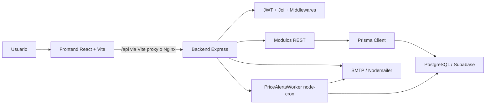

# MotorMatch

[](https://nodejs.org/)
[](https://react.dev/)
[](https://expressjs.com/)
[](https://www.prisma.io/)
[](https://supabase.com/)
[](https://www.docker.com/)
[](LICENSE)

MotorMatch es una aplicacion web para apoyar la compra de motocicletas en Colombia. El sistema cruza presupuesto, uso esperado, medidas fisicas, preferencias de marca, favoritos, comparaciones y alertas de precio para entregar recomendaciones tecnicas y economicas.

## Tabla de contenido

- [Descripcion general](#descripcion-general)
- [Problema que resuelve](#problema-que-resuelve)
- [Objetivos](#objetivos)
- [Caracteristicas principales](#caracteristicas-principales)
- [Capturas](#capturas)
- [Arquitectura](#arquitectura)
- [Stack tecnologico](#stack-tecnologico)
- [Estructura del proyecto](#estructura-del-proyecto)
- [Instalacion local](#instalacion-local)
- [Ejecucion](#ejecucion)
- [Base de datos y seeds](#base-de-datos-y-seeds)
- [Cron jobs](#cron-jobs)
- [Scripts disponibles](#scripts-disponibles)
- [Troubleshooting](#troubleshooting)
- [Documentacion completa](#documentacion-completa)
- [Roadmap](#roadmap)

## Descripcion general

MotorMatch implementa una SPA en React + Vite y una API REST en Node.js + Express. La API usa Prisma como ORM sobre PostgreSQL/Supabase, autenticacion JWT, validacion con Joi, correo SMTP para verificacion y recuperacion de contrasena, y un worker con `node-cron` para procesar alertas de precio.

## Problema que resuelve

Comprar una motocicleta puede ser dificil cuando el usuario debe comparar precios, cilindraje, peso, altura del asiento, uso diario, presupuesto real y costos asociados. MotorMatch centraliza esa informacion y la convierte en recomendaciones explicables, comparaciones guardadas, favoritos y alertas que ayudan a tomar una decision informada.

## Objetivos

- Recomendar motocicletas compatibles con el perfil del usuario.
- Reducir la incertidumbre tecnica y economica antes de comprar.
- Permitir comparacion entre 2 y 3 motos.
- Guardar favoritos, historial de comparaciones y simulaciones.
- Notificar oportunidades cuando una moto alcanza un precio objetivo.
- Mantener una arquitectura modular, documentada y lista para despliegue.

## Caracteristicas principales

- Registro, login, verificacion de correo y recuperacion de contrasena.
- Catalogo de motocicletas con busqueda, filtros por marca, precio y cilindraje.
- Cuestionario de presupuesto, uso, estatura, peso y comodidad con motos pesadas.
- Recomendaciones con scoring de compatibilidad y razones explicables.
- Favoritos por usuario.
- Comparacion de 2 o 3 motocicletas e historial reciente.
- Simulador de costos con historial autenticado.
- Alertas de precio con estados `ACTIVE`, `PAUSED` y `DELETED`.
- Historial de notificaciones de alertas.
- Resenas por motocicleta con moderacion basica de palabras bloqueadas.
- Analitica de mercado basada en favoritos y recomendaciones.
- Soporte por formulario y tracking de compartidos por WhatsApp.

## Capturas

> TODO: agregar capturas reales antes de la presentacion final.

| Vista | Placeholder |
| --- | --- |
| Login / Registro | `docs/assets/screenshots/auth.png` |
| Home / Catalogo | `docs/assets/screenshots/home.png` |
| Detalle de moto | `docs/assets/screenshots/motorcycle-detail.png` |
| Cuestionario | `docs/assets/screenshots/questionnaire.png` |
| Recomendaciones | `docs/assets/screenshots/recommendations.png` |
| Comparacion | `docs/assets/screenshots/comparison.png` |
| Alertas de precio | `docs/assets/screenshots/price-alerts.png` |

## Arquitectura



La aplicacion esta organizada por modulos en backend y por features en frontend:

- Backend: `backend/src/modules/*` contiene rutas, controladores, servicios y validaciones.
- Frontend: `Frontend/src/features/*` contiene componentes, hooks y servicios por dominio.
- Infraestructura: `docker-compose.yml`, `docker-compose.prod.yml` y `k8s/`.

## Stack tecnologico

### Backend

- Node.js 20
- Express 4
- Prisma 5
- PostgreSQL/Supabase
- JWT (`jsonwebtoken`)
- Hash de contrasenas con `bcryptjs`
- Joi para validacion
- Nodemailer para SMTP
- Morgan para logging HTTP en desarrollo
- `node-cron` para alertas de precio

### Frontend

- React 18
- Vite 5
- React Router DOM 6
- Axios
- Context API en `Frontend/src/features/questionnaire/context/questionnaireContext.jsx`
- Estado de sesion con `sessionStorage` y `localStorage` (`mm_token`)
- `@react-pdf/renderer` para PDF de comparacion
- `ics` para calendarios
- CSS propio por componentes y paginas

### DevOps e infraestructura

- Docker y Docker Compose
- Dockerfile backend en `backend/Dockerfile`
- Dockerfile frontend multi-stage en `Frontend/Dockerfile`
- Nginx para servir SPA y proxy `/api` en produccion
- Kubernetes base y overlay local en `k8s/`
- Variables de entorno desde `.env.example` y `backend/.env.example`
- Scripts PowerShell para Docker: `start.ps1`, `stop.ps1`, `logs.ps1`, `migrate.ps1`, `prisma-studio.ps1`

## Estructura del proyecto

```text
MotorMatch-SATEPCMC-/
|-- backend/
|   |-- prisma/
|   |   |-- schema.prisma
|   |   `-- cleanup-firebase.sql
|   |-- scripts/
|   |   |-- data/motosColombia.csv
|   |   |-- importBikes.js
|   |   |-- enrichBike.js
|   |   |-- fixUserBudget.js
|   |   `-- updatePrices.js
|   |-- src/
|   |   |-- config/
|   |   |-- middlewares/
|   |   |-- modules/
|   |   |-- utils/
|   |   |-- workers/priceAlerts.worker.js
|   |   |-- app.js
|   |   `-- server.js
|   |-- Dockerfile
|   `-- package.json
|-- Frontend/
|   |-- src/
|   |   |-- features/
|   |   |-- pages/
|   |   |-- services/apiClient.js
|   |   |-- shared/
|   |   |-- App.jsx
|   |   `-- main.jsx
|   |-- Dockerfile
|   |-- Dockerfile.dev
|   |-- nginx.conf
|   |-- vite.config.js
|   `-- package.json
|-- docs/
|   |-- api/
|   |-- database/
|   |-- deployment/
|   |-- assets/screenshots/
|   |-- recommendation-system/
|   |-- user-guide/
|   |-- maintenance/
|   `-- guias Docker existentes preservadas
|-- k8s/
|-- docker-compose.yml
|-- docker-compose.prod.yml
|-- .env.example
`-- README.md
```

> Nota: las guias Docker existentes se conservaron dentro de `docs/` junto con la documentacion nueva.

## Instalacion local

### Requisitos

- Node.js 20+
- npm
- PostgreSQL local o proyecto Supabase
- Docker Desktop, opcional pero recomendado
- PowerShell en Windows o shell compatible en Linux/macOS

### Variables de entorno

1. Copia la plantilla:

```bash
cp .env.example .env
```

En Windows PowerShell:

```powershell
Copy-Item .env.example .env
```

2. Completa como minimo:

```env
NODE_ENV=development
DATABASE_URL="postgresql://..."
DIRECT_URL="postgresql://..."
JWT_SECRET="secreto_largo_y_aleatorio"
JWT_EXPIRES_IN=7d
FRONTEND_URL=http://localhost:5173
APP_URL=http://localhost:5173
SMTP_HOST=smtp.gmail.com
SMTP_PORT=587
SMTP_USER=tu_email@gmail.com
SMTP_PASS=tu_app_password
POSTGRES_PASSWORD=postgres_dev_password
```

No subas `.env` al repositorio.

## Ejecucion

### Opcion recomendada: Docker Compose

Linux/macOS:

```bash
docker compose up --build
```

Windows PowerShell:

```powershell
.\start.ps1 -build
```

Servicios:

- Frontend dev: `http://localhost:5173`
- Backend API: `http://localhost:3000/api`
- Health check: `http://localhost:3000/api/health`
- PostgreSQL local opcional: `localhost:5432`

### Backend local sin Docker

```bash
cd backend
npm install
npm run db:generate
npm run db:migrate
npm run import-bikes
npm run dev
```

Windows PowerShell:

```powershell
Set-Location backend
npm install
npm run db:generate
npm run db:migrate
npm run import-bikes
npm run dev
```

### Frontend local sin Docker

```bash
cd Frontend
npm install
npm run dev
```

Vite corre en `http://localhost:5173` y proxy `/api` hacia `VITE_API_URL` o `http://localhost:3000`.

## Base de datos y seeds

El schema real esta en `backend/prisma/schema.prisma`. Actualmente no se encontro carpeta `backend/prisma/migrations`; si el equipo decide versionar migraciones, debe generarlas y commitearlas antes de usar `prisma migrate deploy`.

Desarrollo:

```bash
cd backend
npm run db:migrate
npm run db:generate
npm run import-bikes
npm run enrich-bikes
```

Docker:

```bash
docker compose exec backend npm run db:migrate
docker compose exec backend npm run import-bikes
docker compose exec backend npm run enrich-bikes
```

Windows:

```powershell
.\migrate.ps1 -seed
.\prisma-studio.ps1
```

Produccion, cuando existan migraciones versionadas:

```bash
cd backend
npx prisma migrate deploy
npm start
```

> TODO: crear migraciones Prisma versionadas en `backend/prisma/migrations` y definir un seed formal si se requiere `prisma db seed`.

## Cron jobs

El worker `backend/src/workers/priceAlerts.worker.js` inicia automaticamente en `backend/src/server.js` cuando `NODE_ENV !== 'test'`.

- Variable opcional: `PRICE_ALERT_CRON`
- Valor por defecto: `0 8 * * *` (todos los dias a las 08:00 segun zona horaria del proceso)
- Cooldown anti-spam: 48 horas por alerta
- Batching: lotes de 500 motos con alertas activas

Para ejecutarlo basta con levantar el backend:

```bash
cd backend
npm start
```

o en desarrollo:

```bash
npm run dev
```

## Scripts disponibles

### Raiz

| Script/archivo | Uso |
| --- | --- |
| `start.ps1` | Inicia Docker Compose en Windows, con `-build` y `-prod` |
| `stop.ps1` | Detiene servicios, con `-clean` para volumenes |
| `logs.ps1` | Muestra logs por servicio |
| `migrate.ps1` | Ejecuta migraciones y opcionalmente seed |
| `prisma-studio.ps1` | Abre Prisma Studio desde el contenedor |

### Backend

| Script | Descripcion |
| --- | --- |
| `npm run dev` | Inicia Express con Nodemon |
| `npm start` | Inicia Express en modo normal |
| `npm run db:migrate` | Ejecuta `prisma migrate dev` |
| `npm run db:generate` | Ejecuta `prisma generate` |
| `npm run db:studio` | Abre Prisma Studio |
| `npm run import-bikes` | Importa datos desde `backend/scripts/data/motosColombia.csv` |
| `npm run enrich-bikes` | Enriquecimiento estimado de motos |
| `npm run update-prices` | Script declarado; archivo actual sin implementacion |

### Frontend

| Script | Descripcion |
| --- | --- |
| `npm run dev` | Vite dev server |
| `npm run build` | Build de produccion |
| `npm run preview` | Preview local del build |

## Troubleshooting

### Prisma no reconoce campos nuevos

Ejecuta:

```bash
cd backend
npm run db:generate
```

En Docker:

```bash
docker compose exec backend npm run db:generate
```

### Error conectando a Supabase

- Valida `DATABASE_URL` y `DIRECT_URL`.
- Usa `DATABASE_URL` con pooler para runtime.
- Usa `DIRECT_URL` directa para migraciones.
- Confirma `sslmode=require`.

### El frontend llama `/api/api/...`

`Frontend/vite.config.js` recorta `/api` si `VITE_API_URL` lo trae al final. Configura:

```env
VITE_API_URL=http://localhost:3000
```

### Login devuelve 403

La cuenta debe verificar email antes de iniciar sesion. Si SMTP no esta configurado, revisa los logs del backend porque el enlace puede imprimirse como fallback.

### Docker no refleja cambios

```bash
docker compose down
docker compose up --build
```

### Alertas de precio no se envian

- Verifica que `NODE_ENV` no sea `test`.
- Confirma que la alerta este `ACTIVE`.
- El precio actual de la moto debe ser menor o igual a `targetPrice`.
- El cooldown es de 48 horas desde `lastNotifiedAt`.
- Revisa credenciales SMTP.

## Documentacion completa

- [Indice de documentacion](docs/README.md)
- [API REST](docs/api/README.md)
- [Base de datos](docs/database/README.md)
- [Sistema de recomendaciones](docs/recommendation-system/README.md)
- [Guia de usuario](docs/user-guide/README.md)
- [Despliegue](docs/deployment/README.md)
- [Mantenimiento, QA y roadmap](docs/maintenance/README.md)

## Roadmap

- Publicar especificacion OpenAPI/Swagger generada desde la documentacion actual.
- Agregar CI/CD con GitHub Actions.
- Versionar migraciones Prisma para `migrate deploy`.
- Completar screenshots reales.
- Extraer el worker de alertas a proceso independiente o cola BullMQ/Redis.
- Agregar rate limiting y headers de seguridad.
- Mejorar ranking con aprendizaje desde feedback real.

## Licencia

MIT. Ver [LICENSE](LICENSE).
